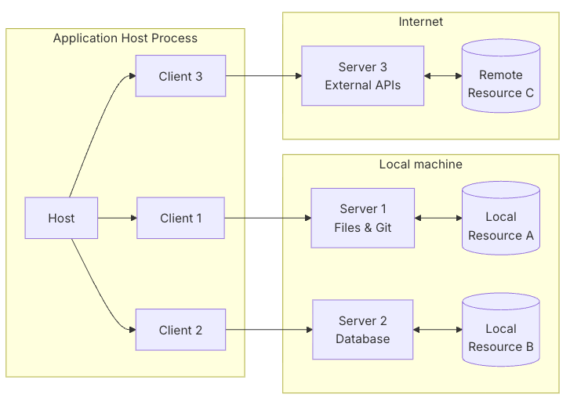

# M(odel) C(ontext) P(rotocol)

## Architecture
- Client-Host-Server architecture where each host can run multiple client instances.
- Stateless: every request is self-contained and carries its own protocol version and capabilities.
- Built on JSON-RPC.

### Core Components

#### Host
A container and coordinator
- Creates and manages multiple client instances
- Controls client connection permissions and lifecycle
- Enforces security policies and consent requirements
- Handles user authorization decisions
- Coordinates AI/LLM integration and sampling
- Manages context aggregation across clients

#### Clients
- Each client communicates with exactly one server
- Attaches protocol version and capabilities to every request
- Routes protocol messages bidirectionally
- Manages subscriptions and notifications
- Maintains security boundaries between servers

#### Servers
Provide specialized context and capabilities:
- Expose resources, tools and prompts via MCP primitives
- Operate independently with focused responsibilities
- Request client input (sampling, elicitation, roots) via InputRequiredResult within a reply
- Must respect security constraints
- Can be either local processes or remote services

### Design Principles
MCP servers:
- Should be extremely easy to build
- Should be highly composable
- Should not be able to read the whole conversation, nor “see into” other servers

Features can be added to servers and clients progressively

## Resources
- https://modelcontextprotocol.io/docs/2026-07-28/getting-started/intro

## Diagrams
- Basic Diagram
